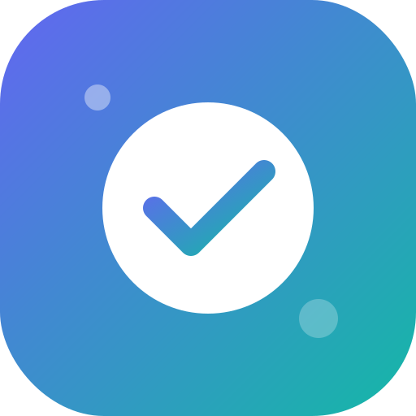

# ZenTodo - Premium Task Manager PWA

ZenTodo is a visually elegant, high-performance, and offline-first Progressive Web App (PWA) designed to organize your daily activities. With sleek animations, a responsive interface, and support for Android device installation, ZenTodo represents the pinnacle of modern web utility design.



## ✨ Features

- **🎯 Task Customization**: Create tasks with titles, detailed descriptions, priority settings (Low, Medium, High), and due dates.
- **🌗 Full Dark Mode Support**: Sleek, eye-friendly slate theme that respects system preference or toggles manually with smooth CSS transitions.
- **🔍 Filter & Sort Controls**: Find tasks quickly via a search box, filter tabs (All, Active, Completed), and sort menus (Newest First, Oldest First, Due Date, Priority).
- **💾 Local Storage Persistence**: Keep your tasks securely stored on your local device. Data persists across browser refreshes.
- **↩️ Undo Task Deletion**: Satisfying card slide-out animation on delete, coupled with an interactive toast notification allowing you to instantly restore a deleted task.
- **📱 PWA Installable (Android/Chrome)**: Includes a custom PWA registration engine, manifest configurations, and a service worker to facilitate installation directly onto Android devices, removing browser URL bars and running offline.

## 📁 File Structure

```text
todolist/
├── index.html     # Semantic markup layout and theme wrappers
├── style.css      # Core Design system, theme modes, and micro-animations
├── app.js         # State controller, filters, DOM updates, and PWA setup
├── manifest.json  # PWA manifest detailing app parameters for launchers
├── sw.js          # Service worker defining caching and offline fallback rules
└── icon.svg       # Premium vector launcher icon
```

## 🚀 Getting Started

### Running Locally
To launch ZenTodo on your local network:
1. Navigate to the project directory:
   ```bash
   cd todolist
   ```
2. Start a local web server (e.g., using Python):
   ```bash
   python -m http.server 8000
   ```
3. Open your browser and navigate to `http://localhost:8000`.

### Installing on Android Devices
1. Access the hosted application URL (or local server address) using a modern browser like Google Chrome or Firefox on your Android device.
2. An **Install ZenTodo** banner will slide down automatically.
3. Tap **Install** to add the application directly to your home screen launcher. It will open in standalone mode with its custom icon.
# CODSOFT
Create a simple to-do list app that allows users to add, edit, and delete tasks.
